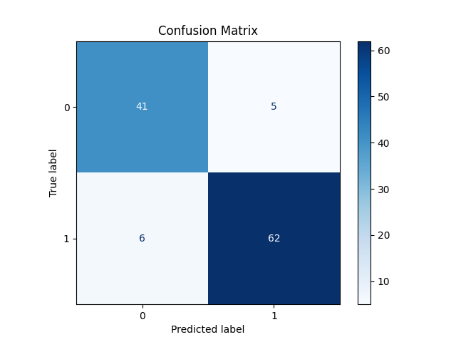

# Breast Cancer Classification with Logistic Regression (from Scratch)

This project implements a logistic regression model **from scratch using NumPy** to perform **binary classification** on the Breast Cancer Wisconsin dataset from `sklearn.datasets`. The goal was to explore and understand the inner workings of logistic regression without relying on machine learning libraries like scikit-learn or TensorFlow.

---

## 🧪 Dataset

- **Source**: `sklearn.datasets.load_breast_cancer()`
- **Samples**: 569
- **Features**: 30 numerical attributes from digitized FNA images
- **Target**:  
  - `0` → Malignant  
  - `1` → Benign

---

## 🧠 Model Summary

- **Algorithm**: Logistic Regression
- **Implementation**: Fully manual (NumPy-based)
- **Training Epochs**: 350
- **Learning Rate (alpha)**: 0.0001
- **Classification Threshold**: 0.4
- **Split**: Manual train/test split

---

## ✅ Results

| Metric               | Score |
|----------------------|-------|
| **Training Accuracy**| 0.916 |
| **Test Accuracy**    | 0.904 |

---

## 🔍 Confusion Matrix

The confusion matrix below shows model performance on the **test set**:

